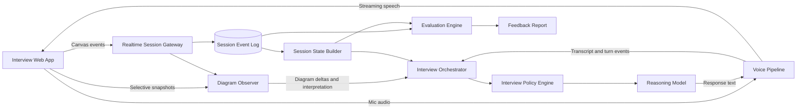

# AI System Design Interviewer: Product and Architecture Strategy

## 1. Product Vision

Build an interview workspace where a candidate can speak and draw a system design while an AI interviewer:

- Understands the evolving diagram, not just the latest screenshot.
- Remembers requirements, assumptions, decisions, and unresolved questions.
- Talks naturally with good turn-taking and can be interrupted.
- Asks useful follow-up questions without constantly distracting the candidate.
- Evaluates the candidate from the full interview timeline rather than isolated answers.

The experience should feel like a collaborative human interviewer observing the candidate's reasoning, not a chatbot reacting to every canvas edit.

## 2. Core Design Principle

Treat the canvas as structured data first and an image second.

A screenshot can show what the diagram looks like, but structured canvas events reveal what changed, when it changed, and how objects relate. The strongest approach is therefore hybrid:

1. Capture structured diagram events continuously.
2. Maintain a normalized graph of the current architecture.
3. Use vision only for freehand content, ambiguous labels, or periodic verification.
4. Fuse the diagram state with the spoken conversation and interview history.

This gives better accuracy, lower latency, lower model cost, and more explainable behavior than repeatedly sending screenshots to a multimodal model.

## 3. Canvas Tracking Strategies

### Strategy A: Structured Diagram Editor

Use a node-and-edge editor such as React Flow, tldraw, or an instrumented Excalidraw integration. Every component, connector, label, deletion, and movement produces an event.

**Advantages**

- Exact component text and connections are available.
- Changes can be interpreted incrementally.
- Easy to create a machine-readable architecture graph.
- Low inference cost and strong evaluation traceability.

**Limitations**

- Can feel restrictive if only predefined system-design shapes are allowed.
- Freehand sketches and unconventional notation remain ambiguous.

### Strategy B: Continuous Visual Understanding

Periodically send a canvas snapshot to a multimodal model and ask it to reconstruct the diagram.

**Advantages**

- Supports arbitrary drawing styles.
- Fastest way to prototype with an existing whiteboard.

**Limitations**

- Higher latency and cost.
- Small labels and crossing arrows are error-prone.
- The model may invent or miss connections.
- A snapshot does not explain the edit history.

### Strategy C: Hybrid Observer (Recommended)

Combine structured events with selective visual analysis:

- Structured objects are the source of truth.
- Freehand strokes are grouped into regions and analyzed only after a pause.
- A snapshot is requested after large or uncertain changes.
- Vision output proposes interpretations; it does not silently overwrite known structure.
- Low-confidence interpretations become clarification questions.

Example: if the candidate draws a box, labels it `Redis`, and connects it to `API`, the event stream already identifies both objects and the edge. Vision is unnecessary. If the candidate sketches a hand-drawn database symbol with no typed label, vision can suggest `database` with a confidence score.

## 4. Recommended System Architecture



### Main Components

#### Interview Web App

- Whiteboard with nodes, arrows, text, freehand drawing, pan, and zoom.
- Streaming microphone input and AI audio playback.
- Visible interview prompt, timer, and optional transcript.
- Non-verbal AI presence indicators such as listening, thinking, and observing the diagram.

#### Realtime Session Gateway

- Maintains a WebSocket or WebRTC session.
- Assigns sequence numbers and timestamps to every event.
- Handles reconnects and resumes sessions without losing ordering.
- Broadcasts state updates to the client and backend workers.

#### Diagram Observer

- Converts editor-specific events into a normalized graph.
- Computes meaningful deltas such as “cache added between API and database.”
- Runs OCR or vision only when structured information is insufficient.
- Attaches confidence and provenance to every inferred fact.

#### Voice Pipeline

Two reasonable implementations are:

1. A realtime speech-to-speech model for the most natural latency and interruptions.
2. Separate streaming speech-to-text, reasoning, and text-to-speech services for more control and easier debugging.

Whichever option is chosen, the pipeline needs voice activity detection, end-of-turn detection, barge-in handling, partial transcripts, and audio cancellation when the candidate interrupts.

#### Interview Orchestrator

- Merges speech, diagram changes, requirements, and timing signals.
- Maintains the authoritative interview state.
- Decides whether to speak now, wait, or silently record an observation.
- Builds compact model context instead of replaying the full raw session.

#### Interview Policy Engine

- Selects the current interview phase and desired competency to probe.
- Applies rules for when and how to intervene.
- Prevents the model from giving away the solution.
- Keeps questions concise and interview-like.

#### Evaluation Engine

- Scores evidence after the interview or at checkpoints.
- Uses the event timeline, transcript, and final diagram.
- Keeps evaluation separate from the live interviewer so scoring does not make the conversation unnatural.

## 5. Diagram Data Model

Store raw events for replay and also maintain a derived graph for reasoning.

```json
{
  "diagramVersion": 42,
  "nodes": [
    {
      "id": "node-api",
      "kind": "service",
      "label": "API Service",
      "position": { "x": 420, "y": 180 },
      "properties": {},
      "confidence": 1.0,
      "source": "structured"
    }
  ],
  "edges": [
    {
      "id": "edge-client-api",
      "from": "node-client",
      "to": "node-api",
      "label": "HTTPS",
      "direction": "forward",
      "confidence": 1.0
    }
  ],
  "groups": [],
  "unresolvedMarks": []
}
```

Example event envelope:

```json
{
  "eventId": "evt-01J...",
  "sessionId": "session-123",
  "sequence": 187,
  "occurredAt": "2026-08-16T10:15:23.412Z",
  "type": "canvas.edge.created",
  "actor": "candidate",
  "payload": {
    "edgeId": "edge-client-api",
    "from": "node-client",
    "to": "node-api"
  }
}
```

Useful event categories include:

- `canvas.node.created`, `updated`, `moved`, and `deleted`
- `canvas.edge.created`, `updated`, and `deleted`
- `canvas.stroke.completed`
- `canvas.selection.changed`
- `speech.partial`, `speech.final`, and `speech.turn.completed`
- `interviewer.response.started`, `interrupted`, and `completed`
- `requirement.recorded`, `decision.recorded`, and `assumption.recorded`

## 6. Converting Edits Into Meaning

Do not ask a language model to reason over every mouse movement. Use a staged pipeline:

1. **Collect:** Capture raw events immediately.
2. **Debounce:** Wait roughly 500–1,500 ms after an edit burst.
3. **Normalize:** Convert shapes and connectors into nodes and edges.
4. **Diff:** Compare the new graph with the last interpreted version.
5. **Classify:** Decide whether the change is cosmetic, structural, or ambiguous.
6. **Interpret:** Describe only meaningful structural changes.
7. **Queue:** Add a possible follow-up without necessarily interrupting.

Examples of semantic deltas:

- “Candidate added Redis as a cache in front of the primary database.”
- “The API service now writes to both a queue and the database.”
- “A new region boundary was added, but cross-region replication is unspecified.”
- “The connection direction between worker and queue is unclear.”

Deterministic graph rules should handle obvious cases. Use a model for semantic naming, ambiguous topology, and linking the edit to what the candidate just said.

## 7. Unified Interview State

The model should receive a compact state object rather than an uncontrolled transcript dump.

```json
{
  "phase": "high_level_design",
  "problem": "Design a URL shortener",
  "requirements": {
    "functional": ["create short URL", "redirect"],
    "nonFunctional": ["high availability", "low redirect latency"],
    "missing": ["retention period"]
  },
  "candidateClaims": [
    "Reads will greatly exceed writes",
    "Short codes use base62"
  ],
  "diagramSummary": "Client -> API -> cache -> database",
  "recentDiagramDelta": "Candidate added cache before database",
  "decisions": [
    { "topic": "storage", "choice": "relational database", "rationale": null }
  ],
  "openQuestions": ["How are code collisions handled?"],
  "competenciesObserved": ["requirements", "basic architecture"],
  "competenciesToProbe": ["capacity estimation", "failure handling"],
  "candidateSpeaking": false,
  "canvasActive": true
}
```

Maintain four memory layers:

- **Immediate context:** Recent transcript and recent diagram delta.
- **Working state:** Requirements, architecture graph, decisions, and open questions.
- **Evidence ledger:** Timestamped evidence mapped to scoring competencies.
- **Raw history:** Full event log for replay and audit, normally excluded from prompts.

## 8. Natural Interview Behavior

Diagram awareness alone will not make the interviewer feel natural. Timing is equally important.

### When the AI Should Speak

- After the candidate finishes a spoken thought.
- When the candidate explicitly asks a question.
- After a meaningful diagram change followed by a short pause.
- When the candidate is stuck for a configurable amount of time.
- When an important contradiction or missing requirement should be probed.
- At phase transitions or time checkpoints.

### When the AI Should Stay Quiet

- During active drawing or continuous speech.
- After cosmetic movements, resizing, or label corrections.
- When a useful observation can wait until the current explanation ends.
- When the candidate has already started addressing the queued question.

### Intervention Priority

Assign every potential intervention a priority and expiry time:

- **High:** Direct question, serious contradiction, or unusable ambiguity.
- **Medium:** Important tradeoff, bottleneck, or missing failure mode.
- **Low:** Optional depth question or minor terminology issue.

Medium and low priority items should be queued. Before speaking, re-check whether later speech or drawing already resolved them.

### Conversational Style

The live interviewer should:

- Ask one question at a time.
- Use short responses, usually one or two sentences.
- Refer naturally to visible work: “You added a cache in front of the database...”
- Ask for reasoning: “What made you choose that placement?”
- Challenge assumptions without being adversarial.
- Avoid long explanations or silently redesigning the candidate's solution.
- Acknowledge interruptions and immediately yield the audio channel.

## 9. Interview Control Loop

```text
receive speech and canvas events
        ↓
update transcript, graph, and interview state
        ↓
detect candidate activity and semantic changes
        ↓
generate or update possible interventions
        ↓
apply timing, priority, and interview-policy rules
        ↓
wait OR ask one concise question
        ↓
record response and evidence, then repeat
```

A useful separation is:

- The **observer** answers “What changed?”
- The **state builder** answers “What do we currently know?”
- The **policy engine** answers “What should we probe next?”
- The **conversation model** answers “How should we say it naturally?”

This is more reliable than one large prompt asking a model to do everything.

## 10. Interview Phases

The policy engine can move through flexible phases rather than a rigid script:

1. **Prompt introduction:** Confirm the problem and interview format.
2. **Requirements:** Encourage functional and non-functional clarification.
3. **Estimation:** Probe traffic, storage, or throughput where relevant.
4. **High-level design:** Let the candidate establish major components and flows.
5. **Deep dive:** Select one or two areas based on the diagram and target level.
6. **Reliability and scale:** Explore bottlenecks, failures, consistency, and operations.
7. **Wrap-up:** Invite improvements and summarize remaining tradeoffs.

Phase changes should depend on evidence and remaining time, not only a fixed timer.

## 11. Prompting Strategy

Use separate prompts or model calls for distinct responsibilities.

### Observer Prompt

Inputs: previous graph summary, current graph delta, recent transcript, and optional image crop.

Output: strict structured JSON containing:

- Meaningful changes.
- Likely intent.
- Ambiguities.
- Contradictions.
- Confidence and supporting object IDs.

### Policy Prompt

Inputs: interview state, rubric coverage, queued interventions, time remaining, and candidate activity.

Output:

- `WAIT`, `ACKNOWLEDGE`, `CLARIFY`, `PROBE`, or `TRANSITION`.
- Selected topic and reason.
- Priority and expiry condition.

### Conversation Prompt

Inputs: chosen action, relevant evidence, and style constraints.

Output: one concise utterance suitable for speech.

Structured outputs between stages reduce hallucinations and make the system testable.

## 12. Evaluation Strategy

Evaluate evidence, not keywords or diagram aesthetics. A candidate can draw a standard component without understanding its tradeoffs.

Possible competency dimensions:

- Requirement discovery and scope control.
- Capacity estimation and assumptions.
- Data model and API design.
- Component selection and data flow.
- Scalability and bottleneck analysis.
- Reliability, availability, and failure recovery.
- Consistency and correctness tradeoffs.
- Security, privacy, and observability.
- Communication, prioritization, and adaptability.

For every score, retain:

- The competency.
- A rubric level.
- Timestamped transcript or diagram evidence.
- Confidence.
- Missing or contradictory evidence.

Generate the final report only after reviewing the full timeline. The report should distinguish “not discussed” from “incorrect.”

## 13. Suggested Technology Choices

These are starting points, not hard requirements:

- **Frontend:** React or Next.js with React Flow for structured diagrams, or tldraw for a freer canvas.
- **Realtime transport:** WebRTC for audio and WebSocket for durable application events; LiveKit can simplify media infrastructure.
- **Backend:** TypeScript for a unified web stack, or Python for model-heavy services.
- **Session state:** Redis for active sessions and queues.
- **Persistent data:** PostgreSQL for sessions, normalized events, rubrics, and reports.
- **Artifacts:** Object storage for optional audio recordings and diagram snapshots.
- **Workers:** A queue for vision interpretation, summarization, and post-interview evaluation.
- **Observability:** Distributed traces keyed by `sessionId`, with model latency and intervention decisions recorded.

Model vendors should sit behind interfaces for speech recognition, reasoning, vision, and synthesis. This makes latency, quality, and cost comparisons possible without redesigning the product.

## 14. Latency and Cost Controls

Suggested interaction targets:

- Partial speech transcript: under 300 ms when possible.
- Candidate end-of-turn detection: approximately 300–700 ms.
- First interviewer audio after a completed turn: ideally under 1.5 seconds.
- Structured diagram delta: under 500 ms after an edit pause.
- Visual fallback: asynchronous unless clarification is immediately required.

Cost controls:

- Never send full-resolution canvas images on every edit.
- Send graph deltas, not the entire diagram, for routine reasoning.
- Crop snapshots to changed freehand regions.
- Summarize older conversation turns into durable state.
- Use small models for classification and a stronger model only for difficult reasoning.
- Run the detailed evaluation once after the session rather than continuously.

## 15. Reliability and Safety

- Persist events before expensive interpretation so sessions can be replayed.
- Make event processing idempotent using event IDs and sequence numbers.
- Preserve model confidence and never present uncertain diagram interpretation as fact.
- Allow the candidate to correct the AI: “That arrow is from the queue to the worker.”
- Degrade gracefully to text if audio fails.
- Rebuild session state from the event log after a worker crash.
- Encrypt audio, transcripts, diagrams, and reports at rest and in transit.
- Define retention controls and obtain consent before recording audio.
- Redact secrets or personal data before sending content to third-party model providers.

## 16. Testing Approach

### Deterministic Tests

- Canvas event normalization and graph reconstruction.
- Out-of-order, duplicated, and missing event handling.
- Diagram diff classification.
- Policy rules such as “never speak while candidate is speaking.”
- Session reconstruction from the event log.

### Recorded Scenario Tests

Create replayable interviews that contain synchronized audio transcripts and canvas events. Assert that the system:

- Notices important architecture changes.
- Ignores cosmetic edits.
- Does not interrupt active explanations.
- Revises a queued question when the candidate resolves it.
- Grounds questions in actual diagram objects and spoken claims.

### Human Evaluation

Have experienced interviewers rate:

- Naturalness and interruption quality.
- Relevance and depth of follow-up questions.
- Accuracy of diagram understanding.
- Fairness and evidence quality in scoring.
- Whether the AI accidentally coaches instead of interviewing.

## 17. MVP Roadmap

### Phase 1: Text + Structured Canvas

- Build a structured canvas with nodes, labels, and directed edges.
- Record an event-sourced diagram timeline.
- Use text chat instead of voice.
- Maintain interview state and ask diagram-aware questions.
- Support one interview problem and a simple rubric.

This phase validates the hardest product question: whether graph-aware questioning feels useful.

### Phase 2: Realtime Voice

- Add streaming transcription and speech synthesis or a realtime speech model.
- Implement voice activity detection, turn-taking, and interruption.
- Add intervention queuing so diagram observations do not cause constant interruptions.

### Phase 3: Hybrid Drawing Intelligence

- Add freehand drawing and image-region analysis.
- Add confidence-aware interpretations and clarification flows.
- Support diagram snapshots for periodic verification.

### Phase 4: Evaluation and Scale

- Add evidence-backed scoring and post-interview reports.
- Build scenario replay, quality dashboards, and prompt versioning.
- Support multiple interview problems, seniority levels, and interviewer styles.
- Add multi-tenant privacy, retention, and operational controls.

## 18. Key Risks and Mitigations

| Risk | Mitigation |
| --- | --- |
| AI interrupts too often | Queue observations, use activity signals, and require intervention thresholds |
| Diagram is misunderstood | Prefer structured data, attach confidence, and ask clarifying questions |
| Conversation feels slow | Stream audio, precompute state, and keep model context compact |
| Model gives away solutions | Enforce an interviewer policy and restrict responses to questions or brief nudges |
| Scores are inconsistent | Use evidence-backed rubrics, replay tests, and post-session evaluation |
| Context becomes too large | Store raw history separately and maintain summarized working state |
| Vendor lock-in | Put model and speech services behind provider interfaces |
| Privacy concerns | Consent, encryption, retention controls, and optional non-recording mode |

## 19. Recommended First Prototype

Start with the smallest architecture that tests the core differentiator:

1. React Flow canvas with a limited component palette and editable labels.
2. WebSocket event stream persisted as an append-only session log.
3. A backend graph reducer that produces semantic diagram deltas.
4. A compact interview-state JSON document updated after each completed speech or drawing turn.
5. A policy call that chooses `WAIT` or one short follow-up question.
6. Text chat first, followed by realtime voice once the intervention behavior works.

Avoid starting with freehand computer vision, elaborate scoring, or many interview questions. Those features add substantial uncertainty before the central interaction loop has been validated.

## 20. Product Experiments to Run Early

- Compare structured-only and hybrid canvases for candidate comfort.
- Measure how often the AI's diagram references are correct.
- Test intervention delays of 0.5, 1.0, 2.0, and 3.0 seconds.
- Compare fully model-driven intervention timing with rules plus a model.
- Test whether a visible “AI is observing your diagram” indicator builds trust or creates pressure.
- Measure how often candidates correct the AI and whether correction is easy.
- Ask human interviewers to compare AI-generated evidence ledgers with their own notes.

## 21. Success Metrics

- Percentage of meaningful diagram changes correctly understood.
- False-intervention rate after cosmetic or irrelevant edits.
- Interruption rate while the candidate is actively speaking or drawing.
- Median response latency and time to first audio.
- Candidate correction rate for AI diagram references.
- Human-rated relevance of follow-up questions.
- Agreement between AI and human interviewer rubric scores.
- Session completion rate and candidate satisfaction.
- Average model and media cost per completed interview.

The first north-star metric should be: **the percentage of AI follow-up questions that human interviewers judge as timely, grounded, and useful.**
