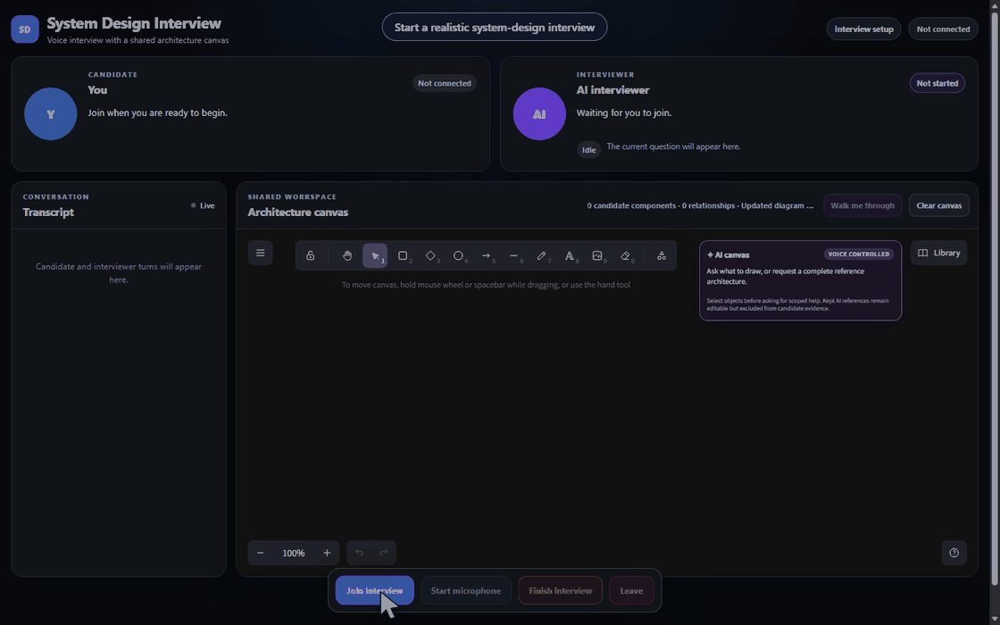
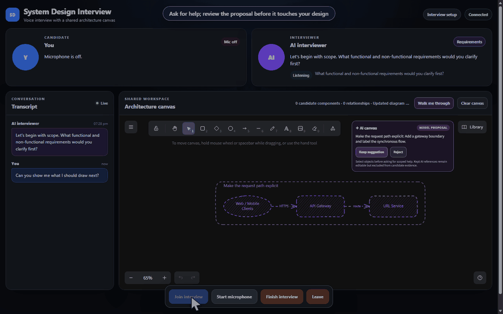
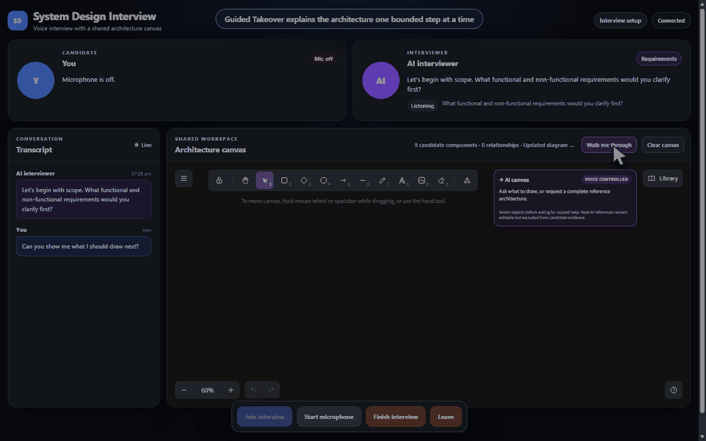

# AI System Design Interviewer

> Practice high-level and low-level design interviews with an AI interviewer that listens, watches your architecture canvas, and helps you reason—not just recite answers.

<p align="center">
  
</p>

[](#project-status)
[](#quick-start)

## Watch the voice loop

https://github.com/user-attachments/assets/1fc8c53d-c33e-4e52-ae6b-3334e91585e1

[Download the repository copy of the 90-second narrated demo](docs/assets/end-to-end-voice-demo.mp4)

The walkthrough uses the real meeting UI and Guided Takeover state machine. Piper voices the
interviewer and Kokoro voices the candidate locally. The dialogue is scripted and post-synchronized,
so this demonstrates the complete interaction design rather than live STT or latency performance.

## Why this exists

Most interview practice tools evaluate text. System design interviews are different: you speak, draw, revise assumptions, label flows, and defend trade-offs in real time. This project explores an AI interviewer that keeps those modalities in one loop:

- **Talk naturally** while local VAD and speech recognition detect complete turns.
- **Draw in Excalidraw** while the interviewer reads structured diagram semantics.
- **Get grounded feedback** tied to the exact component or relationship under discussion.
- **Switch between interview, hint, tutor, and guided-takeover styles** without losing the thread.
- **Run voice locally** with faster-whisper, Silero VAD, and Piper; use Databricks or Azure AI Foundry for the planner when desired.

## See it in action

### Ask the AI to sketch with you

Suggestions arrive as purple, reviewable previews. Keep, reject, edit, or undo them without turning AI-authored work into candidate evidence.

<p align="center">
  
</p>

### Let it teach one step at a time

Guided Takeover pauses scoring and builds a reference path in bounded steps. Ask why, explore an alternative, continue, or take control back whenever the idea clicks.

<p align="center">
  
</p>

A good demo flow is: clarify requirements → draw the first architecture → ask for a bounded hint → refine the diagram → receive final feedback.

## Architecture

```text
Browser microphone + Excalidraw
              │
              ▼
       WebSocket session
              │
      Silero VAD + turn gate
              │
      faster-whisper base.en
              │
   stateful interview engine
   + structured canvas snapshot
              │
     mock / Databricks / Azure
              │
        Piper local TTS
              │
       browser audio playback
```

The repository is intentionally modular: swap the LLM provider, speech backend, or canvas client without rewriting the interview engine.

## Quick start

### 1. Install prerequisites

- Python 3.11+
- [`uv`](https://docs.astral.sh/uv/)
- A modern browser with microphone permissions
- Node.js 22+ and `pnpm` only if you rebuild the frontend bundle

The included scripts work on Windows PowerShell. The Python package and model caches live under the repository by default; no hard-coded drive or machine path is required.

### 2. Bootstrap dependencies and local models

```powershell
# Windows PowerShell
.\scripts\bootstrap.ps1
```

This installs the project with `uv`, then downloads the pinned Silero VAD, `base.en` Whisper, Piper voice, and optional Kokoro artifacts. To install Python dependencies without downloading models:

```powershell
.\scripts\bootstrap.ps1 -SkipModels
```

On macOS/Linux, run the equivalent commands manually:

```bash
uv sync
uv run python scripts/download_models.py --all
```

### 3. Start the app

Dependency-free UI smoke test:

```powershell
. .\scripts\env.ps1
uv run voice-interviewer serve --mock
```

Full local voice pipeline with the mock interviewer planner:

```powershell
. .\scripts\env.ps1
uv run voice-interviewer serve
```

Open **http://127.0.0.1:8000**, allow microphone access, and join an interview. The workspace puts the candidate and interviewer at the top, transcript on the left, and the architecture canvas front and center.

## Try these interactions

1. Say: “Let’s clarify the requirements.”
2. Draw a client, service, datastore, and labelled arrows.
3. Ask: “What should I draw next?”
4. Ask: “Show me a complete reference architecture.”
5. Toggle help strictness or request a guided takeover.
6. Finish the interview to see evidence-based feedback.

AI canvas changes appear as reviewable purple previews. You decide what to keep; candidate-authored elements remain the source of interview evidence.

## Configure a remote planner (optional)

The default planner is mock, so the project runs without credentials. For a real planner, copy the relevant variables from `.env.example` into your shell environment and choose one backend:

```text
VOICE_LLM_BACKEND=databricks
# or
VOICE_LLM_BACKEND=azure_foundry
```

See `docs/LLM_PROVIDERS.md` for endpoint formats, authentication, retries, streaming, and structured-output requirements. Keep credentials server-side and never commit them.

## Project status

This is a research prototype, not a production hiring tool. The most valuable feedback is about interview realism, diagram grounding, latency, and learning outcomes. Expect rough edges and breaking changes while the interaction model evolves.

## Development

```bash
uv run pytest
uv run ruff check .
```

After changing `frontend/`, rebuild the checked-in bundle:

```powershell
.\scripts\build_frontend.ps1
```

Regenerate the README media from the deterministic mock experience with Edge or Chrome installed:

```powershell
uv run python scripts/capture_readme_demos.py
uv run python scripts/capture_end_to_end_demo.py
```

Useful deeper dives:

- `docs/VOICE_PIPELINE.md` — local audio pipeline and operational limits
- `docs/STT_MEMORY_FINDINGS.md` — diagnosing Windows native allocation failures
- `docs/TTS_LATENCY_FINDINGS.md` — why speech can start several seconds late
- `docs/STRUCTURED_CANVAS.md` — semantic Excalidraw representation
- `docs/INTERVIEW_ENGINE.md` — phases, evidence, and progression
- `docs/LLM_PROVIDERS.md` — Databricks and Azure AI Foundry adapters
- `docs/EVALUATION_PLAN.md` — research metrics and test scenarios

## Contributing

Ideas, issue reports, and experiments are welcome. Please include your OS, Python version, backend settings, and a short reproduction when reporting a bug. For larger changes, open an issue first so the interaction contract stays coherent.

## License and voice-model notice

Code is released under the repository license. The bundled Piper voice is included for research use under its upstream model and dataset terms; review those terms before redistribution or commercial use.
