# Technical Product Demo Storyboard

## Audience and Outcome

**Audience:** A technical team already building an AI interviewer and evaluating whether the
presenter can reason sharply about architecture, orchestration, voice UX, evaluation, and
production trade-offs.

**Recommended length:** 15 to 17 minutes, followed by technical Q&A.

**One-sentence thesis:** This is not a speech-to-speech wrapper; it is an observable interview
system in which local voice models, a semantic canvas, a provider-neutral LLM planner, and a
deterministic state reducer collaborate without giving the LLM authority over session truth.

The audience should leave believing that the presenter:

1. Separates model capability from product orchestration.
2. Understands latency, memory, privacy, and failure boundaries.
3. Can make a multimodal conversation coherent and auditable.
4. Tests behavior rather than relying on an impressive happy-path prompt.
5. Knows exactly which parts are prototype-grade and what must happen next.

### Visual Direction

- Keep the video screen-first; use a small presenter camera only for the opening and close.
- Use one visual color for local inference, another for the remote planner, and a third for
  deterministic policy/state.
- Put a small `LOCAL` or `REMOTE` badge beside each model on the model slide.
- Use deliberate cursor movement and stop circling elements while speaking about a different
  subsystem.
- Keep terminal output at a readable font size and show only sanitized readiness or test output.
- Prefer straight cuts between slide, terminal, and browser; avoid decorative transitions that
  make the technical proof feel staged.

## Recording Configuration

State this configuration explicitly near the beginning:

- **Speech detection:** Silero VAD ONNX, local CPU.
- **Speech to text:** `faster-whisper base.en`, local CPU INT8.
- **Interview planner:** Databricks Responses endpoint for the main take.
- **Text to speech:** Kokoro-82M v1.0 INT8, local CPU.
- **Canvas:** Excalidraw in the browser with a semantic scene reducer.
- **Session state:** In-memory, per WebSocket session, reducer-controlled.
- **Fallback take:** The same real local voice and canvas stack with only the LLM planner changed
  to the deterministic local mock.

Do not call this a native speech-to-speech system. Audio is deliberately split into VAD, final
STT, reasoning, and TTS stages so that the transcript, diagram evidence, and interview policy are
observable and independently replaceable.

## Verified Footprint Sheet

### On-Disk Artifacts

These values were measured from the checked-in workspace artifacts. Use binary MiB, not decimal
MB, in the recording.

| Component | Configuration | Artifact footprint | Important detail |
| --- | --- | ---: | --- |
| Silero VAD | ONNX, CPU | 2.22 MiB | 512 samples per frame, 32 ms at 16 kHz |
| `base.en` | CTranslate2/faster-whisper | 140.93 MiB | `model.bin` is 138.49 MiB; runtime compute is INT8 |
| Kokoro-82M | INT8 ONNX | 88.08 MiB | Shared acoustic model |
| Kokoro voices | `voices-v1.0.bin` | 26.91 MiB | Separate voice embeddings; default `af_heart` |
| **Local model total** | VAD + STT + TTS | **258.14 MiB** | Does not include Python packages or browser memory |
| Excalidraw bundle | Browser production assets | 7.55 MiB | UI code, not a model |
| Databricks planner | Remote serving endpoint | 0 local model MiB | Provider-side model memory is not locally observable |

### Runtime Memory Sample

Artifact size is not RAM usage. A one-process Windows `GetProcessMemoryInfo` probe on the current
development machine produced the following working-set snapshots after real VAD inference and a
real STT decode.
Kokoro was loaded into ONNX Runtime; the final row was captured before its first phonemizer and
synthesis call.

| Stage in one Python process | Working set | Increment from prior stage |
| --- | ---: | ---: |
| Python + NumPy baseline | 33.04 MiB | - |
| After Silero inference | 70.39 MiB | 37.35 MiB |
| After one `base.en` transcription | 237.27 MiB | 166.88 MiB |
| After Kokoro model and voices load | 375.56 MiB | 138.29 MiB |

Use this wording:

> The local artifacts are about 258 MiB on disk. On this machine, the cumulative warm Python
> working set reached about 376 MiB before the browser and before Kokoro's first synthesis. That
> is a sample, not a deployment guarantee. Native runtimes can reserve substantially more memory,
> so the current setup guidance conservatively asks for roughly 2 GB of free RAM and production
> sizing needs workload-specific profiling.

Do not sum isolated model measurements, equate model files with resident RAM, or imply that the
remote Databricks model runs locally.

## Model Configuration Talking Points

Keep this section to approximately 90 seconds in the recording.

### Silero VAD

- Consumes mono 16 kHz audio in 512-sample frames.
- Preserves recurrent state plus 64 samples of context between frames.
- Uses a `0.5` speech threshold, `0.35` negative threshold, 192 ms minimum speech, 256 ms prefix
  padding, and 1,200 ms of silence to close an utterance.
- Solves speech endpointing only. It does not decide that the candidate has yielded the interview
  turn.

### `faster-whisper base.en`

- English-only Whisper encoder-decoder model executed through CTranslate2.
- CPU, INT8 compute, four CPU threads, beam size 1, best-of 1, temperature 0.
- Receives NumPy audio directly, so the path has no system FFmpeg dependency.
- Produces one final transcript per VAD-delimited utterance; unstable partials never trigger the
  interviewer.
- Receives a bounded vocabulary prompt containing terms such as `Redis`, `PostgreSQL`, `base62`,
  `QPS`, and selected diagram labels.

### Kokoro-82M

- Quantized ONNX model with a separate voice pack.
- Default voice `af_heart`, `en-us`, speed `1.0`.
- Produces mono signed PCM16 at 24 kHz for browser playback.
- Loads lazily and is retained in the server process.
- Current limitation: a complete interviewer utterance is synthesized before one audio chunk is
  sent; clause streaming is not implemented yet.

### Databricks Planner

- Receives no raw audio and no canvas pixels.
- Receives the final transcript, compact semantic diagram, active question, current phase,
  assumptions, decisions, recent evidence, rubric coverage, and six recent turns.
- Returns one strict structured interview plan rather than directly mutating session state.
- Uses a provider-neutral gateway also implemented for Azure AI Foundry.
- Provider memory and inference internals remain server-side and should not be mixed into local
  footprint claims.

## Architecture Visual

Use a clean full-screen rendering of this diagram. Reveal the upper audio path first, then the
lower canvas path, and finally the reducer and TTS return path.

```mermaid
flowchart LR
    MIC[Browser microphone] -->|PCM16 16 kHz| VAD[Silero VAD]
    VAD --> SEG[Utterance segmenter]
    SEG --> STT[base.en STT]
    STT --> GATE[Canvas-aware turn gate]

    CANVAS[Excalidraw scene] --> NORMALIZE[Semantic reducer]
    NORMALIZE -->|nodes, edges, groups, delta| VALIDATE[Backend validation]
    VALIDATE --> GATE

    GATE --> STATE[Per-session interview state]
    STATE --> PLAN[Mock / Databricks / Azure planner]
    PLAN --> REDUCER[Typed plan + deterministic reducer]
    REDUCER --> TTS[Kokoro TTS]
    TTS -->|PCM16 24 kHz| PLAY[Browser playback]
    REDUCER --> UI[Phase, question, evidence, rubric, feedback]
```



### Architecture Narration

Use this near-verbatim:

> There are two asynchronous input streams: candidate speech and diagram edits. The browser
> resamples microphone audio to 16 kHz PCM. Silero closes a speech segment, base.en produces a
> final transcript, and a separate turn gate waits until the candidate is no longer speaking and
> the canvas is quiet. In parallel, Excalidraw elements become validated nodes, edges, groups,
> selections, and semantic deltas. The LLM sees that compact representation, not a screenshot.
>
> The planner then proposes a typed action: classify the candidate's intent, update evidence,
> answer or follow up, and optionally request the next adjacent phase. Local code validates and
> reduces that plan. The LLM proposes; the reducer disposes. Only the accepted text reaches local
> TTS, while the same accepted state is projected into the UI.

### Five Invariants to Put On Screen

1. Raw audio never goes to the LLM.
2. Only finalized transcripts can trigger reasoning.
3. Canvas semantics are validated before entering context.
4. The LLM cannot skip arbitrary phases or directly mutate state.
5. Diagram-only evidence cannot upgrade the live rubric.

## Master Timeline

| Time | Screen | Story beat | Proof delivered |
| --- | --- | --- | --- |
| 00:00-00:15 | Optional UI teaser | Ask, "Can you see my diagram?" and play the grounded reply | Immediate multimodal hook |
| 00:15-00:45 | Title + thesis | Define the product as an orchestrated interview system | Frames the work beyond a chatbot |
| 00:45-02:15 | Model stack table | Brief VAD, STT, planner, and TTS configurations | Shows deliberate model selection |
| 02:15-03:00 | Disk and working-set tables | Separate artifact size, working set, and remote memory | Shows measurement discipline |
| 03:00-04:30 | Architecture diagram | Walk speech, canvas, planner, reducer, and playback paths | Shows system boundaries |
| 04:30-05:30 | Interview-state slide | Explain phase, active question, evidence, and rubric provenance | Explains conversational coherence |
| 05:30-06:15 | Provider slide or sanitized `doctor` output | Databricks/Azure contract, schema, retries, and secret boundary | Shows interoperability and safety |
| 06:15-06:45 | Live UI, disconnected | Explain participant cards, transcript, setup, and canvas | Sets viewer orientation |
| 06:45-13:45 | Live interview | Requirements through wrap-up with drawing and two repair tests | End-to-end product proof |
| 13:45-14:45 | Feedback + transcript | Finish and inspect evidence-backed feedback | Shows auditable outcome |
| 14:45-15:45 | Tests + limitations slide | State validated behavior and production gaps | Shows engineering maturity |
| 15:45-16:15 | UI hero shot | Deliver close and invite technical questions | Leaves a crisp takeaway |

## Scene-by-Scene Presenter Script

### Scene 1: Thesis

**Screen:** Title, then one-line pipeline.

**Say:**

> I built this to explore the difficult part of an AI interview product: not speech generation,
> but maintaining conversational ownership while the candidate talks, pauses, draws, asks a
> meta-question, and gradually supplies evidence. The design keeps voice local, makes the canvas
> machine-readable, and treats the LLM as a bounded planner rather than the source of truth.

**Avoid:** A feature list, claims of human equivalence, or calling the UI production-ready.

### Scene 2: Models and Memory

**Screen:** The model and footprint tables.

**Action:** Point to one row at a time; finish on the cumulative working-set row.

**Say:** Cover the verified facts above, then explicitly distinguish local voice models from the
remote core model. End with: "The model choice is less important than preserving an adapter
boundary around each stage."

**Proof point:** You understand the difference between disk size, working set, native runtime
reservations, and provider-side infrastructure.

### Scene 3: Architecture

**Screen:** Architecture diagram.

**Action:** Trace the voice path, trace the canvas path, then circle state and reducer.

**Say:** Use the architecture narration above.

**Technical emphasis:**

- VAD endpointing and turn ownership are different decisions.
- A 1,200 ms speech-silence window and 1,500 ms canvas-quiet window overlap where possible.
- Saying "let me draw" holds the response so the interviewer does not interrupt the action.
- Candidate barge-in cancels pending response delivery and stops browser playback.

### Scene 4: Why the Conversation Is Coherent

**Screen:** A compact slide with these fields:

```text
phase
currentQuestion { id, text, topic, expectedEvidence, status }
assumptions[]
decisions[]
recentTurns[6]
evidence[] { source, competency, objectIds }
rubric[9]
```

**Say:**

> A prompt containing only the latest transcript will ask random but plausible questions. This
> engine carries an active question and forces the planner to classify whether it was answered,
> partially answered, or not answered before selecting the next action. Phase transitions are
> adjacent and evidence-driven. Obvious repairs, such as repeating the active question or saying
> what is actually on the diagram, bypass the provider entirely.

**Proof point:** The product fixes randomness with state and policy, not a longer persona prompt.

### Scene 5: Provider Boundary and Safety

**Screen:** Sanitized `doctor` output or a three-row provider matrix. Never display `.env`.

**Say:**

> Databricks Responses and Azure Foundry Chat Completions have different wire formats and auth,
> but the interview engine consumes one gateway contract. Structured JSON is parsed and validated
> before state changes. Timeouts and transient failures have bounded retries; a partially emitted
> stream is never retried because that could duplicate content. Credentials stay in the backend
> process, and provider errors exclude bodies and authorization values.

**Proof point:** The interface is provider-neutral without pretending providers are identical.

### Scene 6: Orient the Live UI

**Screen:** Browser at `http://127.0.0.1:8000`, before connecting.

**Action:**

1. Open **Interview setup** and show `Design a URL shortener` plus the technical glossary.
2. Point to the candidate and AI interviewer cards at the top.
3. Point to the scrollable transcript on the left.
4. Point to the Excalidraw canvas as the primary workspace.
5. Point to the compact meeting controls at the bottom.

**Say:**

> The interface now follows a familiar meeting model. The two participants stay visible at the
> top, both sides of the conversation accumulate in a small transcript pane, and the architecture
> canvas gets most of the space. The candidate sees the current phase and question without being
> distracted by raw state, rubric internals, or protocol events.

### Scene 7: Connect and Hear the Opening

**Action:** Click **Join interview**, wait for the introduction, then click **Start microphone**.

**Expected UI:**

- Status becomes `Connected`.
- Phase becomes `Requirements`.
- A requirements question becomes the active thread.
- Local Kokoro plays the same accepted interviewer text shown in the UI.

**Do not narrate over the introduction.** Capture system audio and microphone on separate tracks.

### Scene 8: Intentionally Give a Bad First Answer

**Candidate says:**

> I would probably use Redis and Kafka.

Then stop speaking for at least 1.2 seconds.

**Expected invariant:** The interviewer should not jump to an unrelated architecture probe. It
should keep the requirements thread open, mark the answer partial, and ask for user-visible
behavior or quality constraints. In the deterministic mock baseline, evidence and rubric remain
at zero.

**Presenter callout after the response:**

> I answered at the wrong abstraction level. Notice that the phase and question thread stayed on
> requirements instead of rewarding keyword matching with a random cache question.

This is the most important coherence proof in the demo.

### Scene 9: Requirements and Capacity

**Candidate requirements answer:**

> The core functions are creating a short link and redirecting a short code to the original URL.
> I would clarify custom aliases, expiry, abuse controls, and whether analytics is in scope. I will
> assume redirects dominate writes, 99.99 percent redirect availability, and p99 redirect latency
> below 100 milliseconds. Analytics may be eventually consistent.

**Expected invariant:** Specific acknowledgement, requirements evidence, then an estimation
question. Phase changes to `Estimation` only after relevant evidence.

**Candidate capacity answer:**

> Assume 100 million new links per month, roughly 40 writes per second on average and 400 at peak.
> Assume 10 billion redirects per month, about 4,000 reads per second average and 40,000 at peak.
> At roughly 500 bytes per mapping, one year is around 600 gigabytes before replication. The
> read-heavy ratio makes cache efficiency important.

**Expected invariant:** The estimate appears as an assumption, capacity evidence is added, and the
next phase is `High Level Design`.

### Scene 10: Draw Without Being Interrupted

**Candidate says first:**

> Let me draw for a moment before I explain my choices.

**Action:** Build the diagram in this order:

1. `Client`
2. `Load Balancer`
3. `URL API`
4. `Redis`
5. `URL Mapping DB`
6. `Kafka`
7. `Analytics Worker`

Add bound arrows:

```text
Client -> Load Balancer -> URL API
URL API -> Redis
URL API -> URL Mapping DB
URL API -> Kafka -> Analytics Worker
```

Keep editing or speaking while the drawing is in progress; after the explicit hold expires, a gap
longer than the canvas-quiet interval can yield the turn. Pause drawing for at least 1.5 seconds
only after the final edit. Make sure each arrow endpoint visibly binds to its shape; an arrow
merely placed near a box will not produce a semantic relationship.

**Expected UI:** The diagram summary reports component and relationship counts plus a semantic
delta. The interviewer may say that it can see the drawing but still needs the request-flow
explanation. The phase stays at high-level design, and drawing alone does not increase rubric
coverage.

**Presenter callout:**

> The browser debounces edit bursts, normalizes bound labels and arrows, and sends a semantic
> delta. The backend validates identifiers, bindings, groups, and limits. Geometry is retained in
> session state but omitted from the provider prompt.

### Scene 11: Test Diagram Grounding

**Candidate asks:**

> Can you see my diagram?

**Expected invariant:** The response names real labels from the accepted snapshot and, if arrows
were bound, the first real relationship. It does not invent a component, advance the phase, add
evidence, or replace the active architecture question.

**Presenter callout:**

> That repair was deterministic and did not need a paid provider request. More importantly, it
> preserved the technical question I had not answered yet.

Briefly point to the updated component and relationship summary in the canvas header. Keep raw
diagram JSON out of the candidate-facing product view; use the prepared architecture slide if the
audience asks about the semantic payload.

### Scene 12: Explain the Architecture

**Candidate says:**

> The client sends the short code through the load balancer to a stateless URL API. The API checks
> Redis first. On a cache miss it reads the URL mapping database and repopulates the cache. Link
> creation writes the mapping database before returning the code. Click events go asynchronously
> through Kafka to the analytics worker, so analytics does not add latency to redirects.

**Expected invariant:** The engine records combined transcript-and-diagram evidence with actual
object IDs, marks architecture flow as covered, and moves to a component trade-off.

**Presenter callout:**

> The rectangles established grounding but not competence. The rubric moved only after I
> explained the request flow. That distinction prevents a polished diagram from masquerading as
> design reasoning.

### Scene 13: Deep Dive

Before speaking, select `Redis` or `URL Mapping DB` so the selection is visible in the semantic
snapshot.

**Candidate says:**

> I would generate base62 IDs from a unique numeric identifier rather than retrying random
> collisions. I would partition the mapping table by a hash of the short code for even traffic.
> Redis uses cache-aside because redirects are read-heavy; the database remains the source of
> truth. The trade-off is cache invalidation complexity, so expiry and deletion need an explicit
> invalidation path.

**Expected invariant:** The response acknowledges the rationale, records component or data-model
and trade-off evidence, and asks about failure or overload rather than opening a new random topic.

### Scene 14: Reliability and Wrap-Up

**Candidate reliability answer:**

> I would handle a Redis outage first. The API should fail over to the database with a bounded
> timeout, a circuit breaker, and rate limiting so the fallback cannot overload storage. Database
> failover needs idempotent create requests and an explicit policy for replication lag. I would
> monitor p99 redirect latency, cache hit rate, error rate, saturation, and replication lag.

**Expected invariant:** Reliability evidence is recorded and the engine moves to wrap-up.

**Candidate wrap-up answer:**

> With more time, the biggest improvement is a tested multi-region read and failover strategy. The
> unresolved trade-off is that synchronous global replication improves consistency but increases
> creation latency. I would start with home-region writes, eventual cross-region replication, and
> a measured recovery objective before paying that latency cost everywhere.

**Expected invariant:** The interviewer acknowledges the prioritization and invites finalization.

### Scene 15: Finish and Inspect Feedback

**Action:** Click **Finish interview** once. Do not disconnect first.

**Expected UI:**

- Microphone stops and the final audio buffer is flushed.
- Queued STT finishes before finalization.
- Phase becomes `Complete`.
- The active question clears.
- Feedback separates strengths, improvements, and not-discussed competencies.

After showing the clean product feedback, cut to the prepared interview-state slide and briefly
highlight the internal fields that remain available to evaluation tooling:

1. `phaseHistory`
2. `currentQuestion: null`
3. Evidence records with `source` and `objectIds`
4. Rubric entries and their evidence IDs
5. `completed: true`

**Say:**

> This feedback is not an opaque model score. It is a summary over a bounded evidence ledger.
> Topics we did not reach are labeled not discussed rather than silently marked wrong. A hiring
> product would still need calibrated rubrics, human review, bias analysis, and longitudinal
> validation before using this for decisions.

### Scene 16: Engineering Close

**Screen:** UI hero shot, then a final slide with `Proven`, `Not yet`, and `Next`.

**Proven:**

- Real local VAD, English STT, and TTS operate end to end.
- Canvas nodes, edges, groups, selections, and deltas are extractable and validated.
- Databricks and Azure adapters share a strict planner contract.
- Active-question threading, phase policy, evidence provenance, and final feedback are reducer
  controlled.
- Contract and behavior tests exercise both providers without paid test calls.

**Not yet:**

- Clause-streamed TTS or stable partial transcript display.
- Durable session recovery or multi-tenant capacity management.
- Production evaluation across accents, noisy rooms, roles, levels, and adversarial candidates.
- A calibrated hiring score.
- Provider fallback, circuit breaker, and production observability stack.

**Close with:**

> The prototype proves the coherent loop. The next engineering risk is not whether a larger model
> can ask another question; it is whether we can measure interview quality, preserve evidence and
> fairness, hit latency targets under concurrency, and fail safely. Those are the areas I would
> take into production next.

## Exact Live-Demo State Checkpoints

The wording of a real Databricks planner may vary. These invariants should not. The counts below
are the deterministic mock baseline and are useful during rehearsal.

| Checkpoint | Expected phase | State invariant | Mock baseline tendency |
| --- | --- | --- | --- |
| Connected | Requirements | One active requirements question | 0 evidence, 0/9 observed |
| Bad first answer | Requirements | Question remains partial and relevant | Counts unchanged |
| Requirements answer | Estimation | Requirements evidence references transcript | 1 evidence, 1/9 observed |
| Capacity answer | High Level Design | Quantitative assumption retained | 2 evidence, 2/9 observed |
| Diagram drawn | High Level Design | Snapshot changes; explanation is still requested | 2 evidence, 2/9 observed |
| Diagram question | High Level Design | Grounded answer; question ID preserved | 2 evidence, 2/9 observed |
| Flow explained | Deep Dive | Architecture evidence is combined when objects exist | 3 evidence, 3/9 observed |
| Trade-off explained | Reliability and Scale | Data-model and trade-off reasoning added | 5 evidence, 5/9 observed |
| Failure handled | Wrap Up | Reliability evidence added | 6 evidence, 6/9 observed |
| Wrap-up answered | Wrap Up | Prioritization closes the active question | 7 evidence, 6/9 observed |
| Finish clicked | Complete | No current question; feedback present | 7 evidence; 3 competencies not discussed |

If the Databricks plan violates an invariant, do not hide it. Capture the event and explain whether
the issue belongs to provider output, schema validation, reducer policy, or prompt/evaluation
coverage. That diagnosis is more impressive to this audience than pretending every take is
perfect.

## Diagram Rehearsal Notes

- Use rectangles for services and cylinders for the database if desired; labels drive roles more
  reliably than shape choice.
- Double-click a shape and type inside it so text is bound to the container.
- Drag arrows until the target box highlights at both ends.
- Keep labels short and unique.
- Do not group the whole diagram; demonstrate grouping only if asked in Q&A.
- Select `Redis` before the deep dive to show selection synchronization.
- Avoid moving boxes while speaking unless you intend to hold the interviewer turn.
- Clear the canvas and reconnect between takes; each WebSocket owns a fresh interview state.

## Recording Runbook

### 1. Preflight the Workspace

Run this before opening recording software:

```powershell
. .\scripts\env.ps1
uv run pytest
uv run ruff check .
Push-Location frontend
pnpm test
Pop-Location
```

Expected baseline at the time this storyboard was written: 60 Python tests and 3 frontend scene
normalizer tests pass.

### 2. Start the Real Databricks Take

Use one clean PowerShell window for the server. The `.env` file is passed only to the child
process; never open it on camera.

```powershell
. .\scripts\env.ps1
$env:VOICE_LLM_BACKEND = 'databricks'
uv run --env-file .env voice-interviewer doctor
uv run --env-file .env voice-interviewer serve
```

The `doctor` output is sanitized and reports only readiness booleans. Confirm that Silero and
Kokoro are ready and Databricks is configured. Do not print environment variables or use a shell
command that echoes the token.

### 3. Warm the Same Server Process

In a second PowerShell window, run one hidden preflight turn after the server starts:

```powershell
. .\scripts\env.ps1
uv run python scripts/smoke_voice_turn.py
```

This warms the shared STT and TTS instances inside the server process. With a Databricks-backed
server it also invokes the configured remote planner and may create billable calls. Run it only
when that is acceptable. Its WebSocket session is separate and does not contaminate the recorded
interview state.

### 4. Configure the Browser and Audio

- Use a headset to prevent Kokoro playback from re-entering the microphone.
- Capture application/system audio and microphone on separate recording tracks.
- Grant microphone permission before the final take.
- Use a browser zoom level that keeps both participant cards, the transcript pane, and canvas visible together.
- Hide bookmarks, notifications, password-manager overlays, terminal history, and unrelated tabs.
- Put the browser and architecture slide at fixed positions so window switching is repeatable.
- Add `base62`, `cache-aside`, `idempotency`, `replication lag`, and `circuit breaker` to the
  glossary before connecting.

### 5. Respect the Turn Timers

- Stop speaking for at least 1.2 seconds when yielding the floor.
- Stop editing for at least 1.5 seconds after the last diagram change.
- Do not fill inference latency with nervous speech; that can be interpreted as a continuation or
  barge-in.
- Expect the first cold turn to be slower if the server was not warmed.
- The current TTS path waits for a complete response before audio delivery; do not claim token-to-
  audio streaming.

## Fallback Takes

### Remote Planner Failure

Keep real Silero, `base.en`, Kokoro, and the canvas, but swap only the planner:

```powershell
. .\scripts\env.ps1
$env:VOICE_LLM_BACKEND = 'mock'
uv run voice-interviewer serve
```

Label this take on screen as **Local deterministic planner**. Do not use `serve --mock` for the
main fallback because that replaces VAD, STT, and TTS too.

### STT Misses a Key Term

1. Pause instead of immediately correcting over the interviewer.
2. Let the current response finish.
3. Repeat the answer in shorter clauses with the glossary already populated.
4. If the transcript changes the meaning materially, restart the take rather than editing around
   a false result.

### Diagram Grounding Misses a Relationship

The arrow was probably not bound. Rehearse binding before recording. The deterministic visibility
repair will safely name nodes even when no relationship is valid, but the strongest take includes
one correctly bound edge.

### Latency Spike

Keep one honest latency sample in the final video. If a provider spike dominates the take, use the
clearly labeled local-planner backup rather than silently cutting a remote failure into a local
response.

## Rehearsal Scorecard

Do not record the final take until all of these pass twice:

- [ ] No secret, token, `.env` content, or authorization header appears on screen.
- [ ] Sanitized `doctor` output shows the intended backend readiness.
- [ ] Introduction text and Kokoro audio both arrive.
- [ ] The bad first answer stays in the requirements thread.
- [ ] The diagram produces at least seven nodes and six bound relationships.
- [ ] Drawing alone leaves the rubric unchanged.
- [ ] "Can you see my diagram?" names only real elements and preserves the active question.
- [ ] The spoken request flow creates combined evidence with diagram object IDs.
- [ ] Finish produces strengths, improvements, and a not-discussed distinction.
- [ ] Browser and microphone audio are intelligible on separate tracks.
- [ ] The complete take stays below 17 minutes without rushing candidate speech.

## Claims to Avoid

- "This is true realtime speech-to-speech."
- "The whole system only needs 376 MiB of RAM."
- "The LLM understands every visual property in Excalidraw."
- "The live rubric is a validated hiring score."
- "The system is production-ready for concurrent interviews."
- "Streaming is end to end." The gateway can consume SSE, but state and TTS currently wait for the
  complete structured plan.
- "The Databricks foundation model runs locally."
- "A diagram proves competency." Spoken or combined reasoning evidence is required.

## Likely Technical Q&A

### Why not send audio directly to a multimodal model?

The modular path makes transcript evidence auditable, keeps voice local, supports Databricks and
Azure text planners, and allows independent latency and quality tuning. A native audio model could
later implement the same adapter contract, but it should not own interview state.

### Why semantic canvas data instead of screenshots?

Nodes, labels, bindings, groups, selections, and deltas are compact, validated, and referenceable
in evidence. The trade-off is losing some spatial and stylistic nuance. A future hybrid can add an
occasional image snapshot without abandoning the semantic source of truth.

### What actually fixed the random-question problem?

An authoritative active question, intent and answer-status classification, bounded recent turns,
ordered phases, an evidence ledger, a strict planner schema, and a reducer that rejects invalid
transitions. It was an orchestration problem, not merely a prompt wording problem.

### How is prompt injection handled?

Candidate transcript and canvas labels are serialized as explicitly untrusted evidence. Provider
output must satisfy a strict schema and local validation. Diagram IDs are intersected with the
accepted snapshot, arrays are bounded, and the reducer controls mutations. This reduces risk but
does not replace adversarial evaluation.

### How would this scale to concurrent interviews?

Each WebSocket owns VAD state, turn gating, interview state, and response cancellation. STT and TTS
models are shared; TTS synthesis is currently serialized. Production work requires CPU-thread and
worker benchmarks, queue limits, admission control, latency SLOs, and likely separate inference
workers.

### Why not score the candidate immediately?

The current rubric tracks evidence coverage only. A decision-grade score requires role- and
level-specific rubrics, calibrated human labels, inter-rater agreement, bias and subgroup analysis,
appealability, and validation that the system measures job-relevant skill rather than accent or
presentation style.

### What would you build next?

1. A replayable evaluation corpus with deterministic session events and human quality labels.
2. Clause-streamed, interruptible TTS with played-text reconciliation.
3. Durable opt-in session recovery and privacy/retention controls.
4. Multi-session performance tests and inference isolation.
5. Provider fallback and circuit breakers.
6. Problem-, role-, and level-specific rubric templates.

## Shorter Eight-Minute Cut

If a shorter video is required:

1. Keep the 15-second teaser.
2. Compress models and memory to 60 seconds.
3. Explain only the two-stream architecture and reducer in 75 seconds.
4. In the live demo, retain the bad answer, one requirements answer, one capacity answer, the
   diagram question, one architecture explanation, one failure answer, and finish.
5. End with one limitation slide and the engineering close.

Do not remove the bad-answer test or diagram-only-evidence distinction. Those two moments prove
that this is an interview system rather than a voice-enabled question generator.
