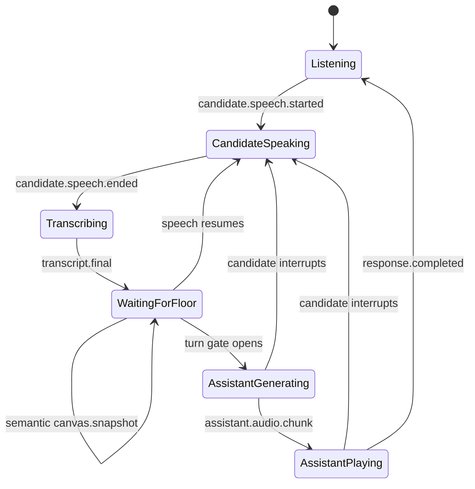

# Realtime Event Protocol

## Transport

- Endpoint: `/ws/interview/{sessionId}`
- Client audio: binary WebSocket messages containing mono PCM signed 16-bit little-endian samples at 16 kHz.
- Client controls: JSON text messages.
- Server events: JSON text messages.
- Server audio: base64 PCM in `assistant.audio.chunk`; each event declares its sample rate. Kokoro currently emits mono 24 kHz output.

Production deployments may move assistant audio to a dedicated WebRTC track while retaining the JSON data channel for control events.

## Server Event Envelope

```json
{
  "type": "candidate.transcript.final",
  "sessionId": "session-123",
  "sequence": 4,
  "timestampMs": 1786877000000,
  "payload": {
    "text": "I would add Redis before the database.",
    "language": "en",
    "durationMs": 3140
  }
}
```

Properties:

- `sequence` is strictly increasing within a session.
- `timestampMs` is server wall-clock time for logs and cross-service correlation.
- Internal scheduling uses a monotonic clock and is unaffected by wall-clock changes.
- Unknown event fields should be ignored for forward compatibility.

## Client Control Events

### `session.configure`

Sent immediately after the WebSocket opens.

```json
{
  "type": "session.configure",
  "payload": {
    "problem": "Design a URL shortener",
    "glossary": ["Redis", "PostgreSQL", "base62", "p99"]
  }
}
```

### `canvas.snapshot`

Sent after a 350 ms scene-change debounce. This is the provider-independent semantic projection of the Excalidraw scene, not its full document or a screenshot.

```json
{
  "type": "canvas.snapshot",
  "payload": {
    "version": 1,
    "revision": 7,
    "nodes": [
      {
        "id": "api",
        "shape": "rectangle",
        "role": "service",
        "label": "API",
        "x": 40,
        "y": 80,
        "width": 180,
        "height": 80,
        "groupIds": ["backend"]
      },
      {
        "id": "db",
        "shape": "ellipse",
        "role": "database",
        "label": "PostgreSQL",
        "x": 320,
        "y": 80,
        "width": 180,
        "height": 80,
        "groupIds": ["backend"]
      }
    ],
    "edges": [
      {
        "id": "api-db",
        "shape": "arrow",
        "label": "SQL",
        "sourceId": "api",
        "targetId": "db",
        "groupIds": ["backend"]
      }
    ],
    "groups": [
      {
        "id": "backend",
        "memberIds": ["api", "api-db", "db"]
      }
    ],
    "selectedObjectIds": ["api"],
    "delta": {
      "addedIds": ["api-db"],
      "updatedIds": [],
      "removedIds": [],
      "summary": "Connected API to PostgreSQL"
    }
  }
}
```

Bound text is folded into its node or edge and cannot appear in `selectedObjectIds`. The backend validates limits, supported versions, unique IDs, bindings, group membership, selection references, and delta references before replacing session state. Semantic edits reset the canvas quiet period; selection-only snapshots do not.

The server answers accepted snapshots with:

```json
{
  "type": "canvas.synced",
  "payload": {
    "revision": 7,
    "nodeCount": 2,
    "edgeCount": 1,
    "selectedObjectIds": ["api"]
  }
}
```

### `canvas.activity`

Accepted as a legacy compatibility event. New clients should use `canvas.snapshot` so the LLM receives validated diagram state instead of an unverified text description.

### `audio.flush`

Signals that the microphone stopped or the client is about to disconnect. The server pads and evaluates the last partial VAD frame, then finalizes any active utterance.

## Server Lifecycle Events

| Event | Important payload | Meaning |
| --- | --- | --- |
| `session.ready` | sample rate, encoding, active backends | Audio may be sent |
| `session.configured` | none | Problem and glossary were accepted |
| `canvas.synced` | revision, node/edge counts, selection | Structured diagram state was accepted |
| `candidate.speech.started` | none | VAD confirmed candidate speech |
| `candidate.speech.ended` | `durationMs` | VAD finalized an utterance |
| `candidate.transcript.final` | text, language, duration | Stable text available |
| `assistant.response.started` | none | Turn gate yielded the floor |
| `assistant.text.final` | `text` | Interviewer response text |
| `assistant.audio.chunk` | audio, encoding, sample rate, channels | Playable PCM audio |
| `assistant.response.completed` | none | All response output was emitted |
| `assistant.interrupted` | `reason` | Stop queued assistant playback |
| `error` | code, message | Recoverable or terminal failure |

## Turn State Machine



## Barge-In Contract

When candidate speech is confirmed during an active assistant response:

1. Server cancels its response task.
2. Server emits `assistant.interrupted`.
3. Browser immediately stops all queued playback sources.
4. Candidate audio continues through VAD and STT.
5. The next interviewer prompt should not assume unheard response content.

The scaffold tracks whether the response was active, but it does not yet report exact text or audio duration played. Kokoro currently generates a full utterance before the audio event; the planned streaming adapter should add played-text reconciliation.

## Errors

| Code | Meaning | Client behavior |
| --- | --- | --- |
| `session_start_failed` | Required model or configuration unavailable | Show setup guidance and close session |
| `invalid_json` | Client control event could not be parsed | Log and continue |
| `unsupported_event` | Unknown client event type | Fix client/version mismatch |
| `invalid_diagram` | Snapshot schema or references are invalid | Keep the last accepted scene and inspect the message |
| `transcription_failed` | Local STT inference failed | Offer retry or text input |
| `response_failed` | LLM or TTS stage failed | Preserve transcript and offer retry |

Production errors should include a stable trace ID but never credentials, raw prompts containing secrets, or full audio content.

## Versioning Backlog

Before independently deploying frontend and backend:

- Add `protocolVersion` to `session.configure` and `session.ready`.
- Define maximum message and audio-frame sizes.
- Reject non-16-kHz audio explicitly or negotiate format.
- Add heartbeat and reconnect/resume messages.
- Add idempotent client event IDs.
- Move base64 audio to binary or WebRTC media transport.
