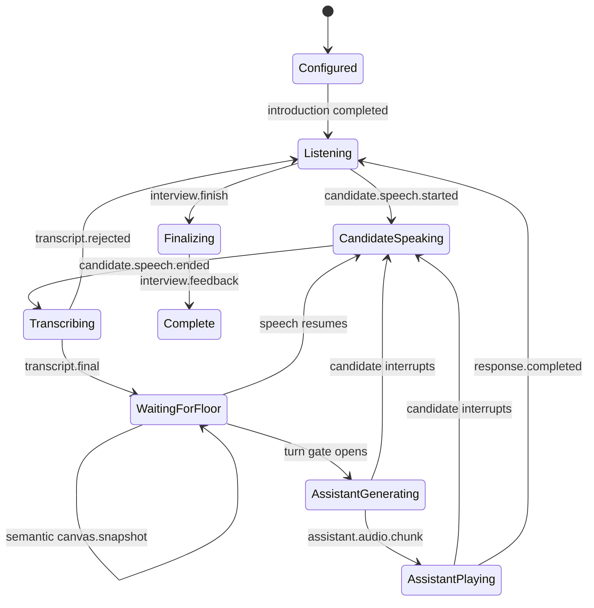

# Realtime Event Protocol

## Transport

- Endpoint: `/ws/interview/{sessionId}`
- Client audio: binary WebSocket messages containing mono PCM signed 16-bit little-endian samples at 16 kHz.
- Client controls: JSON text messages.
- Server events: JSON text messages.
- Server audio: base64 PCM in `assistant.audio.chunk`; each event declares its sample rate. Piper emits mono 22.05 kHz sentence chunks, while the optional Kokoro backend emits mono 24 kHz output.

Production deployments may move assistant audio to a dedicated WebRTC track while retaining the JSON data channel for control events.

## Server Event Envelope

```json
{
  "type": "candidate.transcript.final",
  "sessionId": "session-123",
  "sequence": 4,
  "timestampMs": 1786877000000,
  "payload": {
    "text": "I would add Redis before the database.",
    "language": "en",
    "durationMs": 3140
  }
}
```

Properties:

- `sequence` is strictly increasing within a session.
- `timestampMs` is server wall-clock time for logs and cross-service correlation.
- Internal scheduling uses a monotonic clock and is unaffected by wall-clock changes.
- Unknown event fields should be ignored for forward compatibility.

## Client Control Events

### `session.configure`

Sent immediately after the WebSocket opens.

```json
{
  "type": "session.configure",
  "payload": {
    "problem": "Design a URL shortener",
    "glossary": ["Redis", "PostgreSQL", "base62", "p99"],
    "assistancePolicy": "adaptive"
  }
}
```

`assistancePolicy` accepts `strict`, `adaptive`, or `guided`. Missing or unsupported values fall
back to `adaptive`. The policy is fixed for that WebSocket session.

### `canvas.snapshot`

Sent after a 350 ms scene-change debounce. This is the provider-independent semantic projection of the Excalidraw scene, not its full document or a screenshot.

```json
{
  "type": "canvas.snapshot",
  "payload": {
    "version": 1,
    "revision": 7,
    "nodes": [
      {
        "id": "api",
        "shape": "rectangle",
        "role": "service",
        "label": "API",
        "x": 40,
        "y": 80,
        "width": 180,
        "height": 80,
        "groupIds": ["backend"]
      },
      {
        "id": "db",
        "shape": "ellipse",
        "role": "database",
        "label": "PostgreSQL",
        "x": 320,
        "y": 80,
        "width": 180,
        "height": 80,
        "groupIds": ["backend"]
      }
    ],
    "edges": [
      {
        "id": "api-db",
        "shape": "arrow",
        "label": "SQL",
        "sourceId": "api",
        "targetId": "db",
        "groupIds": ["backend"]
      }
    ],
    "groups": [
      {
        "id": "backend",
        "memberIds": ["api", "api-db", "db"]
      }
    ],
    "assistantLayer": {
      "nodes": [],
      "edges": []
    },
    "selectedObjectIds": ["api"],
    "delta": {
      "addedIds": ["api-db"],
      "updatedIds": [],
      "removedIds": [],
      "summary": "Connected API to PostgreSQL"
    }
  }
}
```

Bound text is folded into its node or edge and cannot appear in `selectedObjectIds`. The backend validates limits, supported versions, unique IDs, bindings, group membership, selection references, and delta references before replacing session state. Candidate semantic edits reset the canvas quiet period; selection-only and assistant-only snapshots do not.

The server answers accepted snapshots with:

```json
{
  "type": "canvas.synced",
  "payload": {
    "revision": 7,
    "nodeCount": 2,
    "edgeCount": 1,
    "assistantNodeCount": 0,
    "assistantEdgeCount": 0,
    "selectedObjectIds": ["api"]
  }
}
```

### `canvas.activity`

Accepted as a legacy compatibility event. New clients should use `canvas.snapshot` so the LLM receives validated diagram state instead of an unverified text description.

### `audio.flush`

Signals that the microphone stopped or the client is about to disconnect. The server pads and evaluates the last partial VAD frame, then finalizes any active utterance.

### `interview.finish`

Requests evidence-backed completion. The browser stops and flushes the microphone first. The server waits for queued transcription, force-consumes any final transcript, cancels active playback, and runs the planner in `finalize` mode.

```json
{
  "type": "interview.finish",
  "payload": {}
}
```

### `guided.takeover.start`

Explicitly authorizes a persistent, multi-step teaching walkthrough. The browser sends it from
**Walk me through**; recognized spoken triggers enter the same server-owned engine path.

```json
{
  "type": "guided.takeover.start",
  "payload": {
    "scope": "selection"
  }
}
```

`scope` may be `selection`, `current_question`, or `end_to_end`. Missing or invalid scope falls
back to the validated current selection when one exists, otherwise the current question. The
first bounded step is generated immediately.

### `guided.takeover.command`

Controls an active walkthrough without re-authorizing each canvas change:

```json
{
  "type": "guided.takeover.command",
  "payload": {
    "command": "continue",
    "question": ""
  }
}
```

Commands are `continue`, `why`, `alternative`, `question`, and `take_back`. `question` carries the
text of a suggested-question chip. `why`, `question`, and `alternative` explain the current step
without advancing or changing the canvas. `continue` retries a failed step or advances exactly
one step. `take_back` returns the floor while preserving the interview's original phase and
question. Invalid commands emit `invalid_guided_takeover_command`.

The pipeline cancels and awaits an older response task before scheduling either trusted control,
so two planners cannot mutate the same session state concurrently. If playback was active, the
server emits `assistant.interrupted` with reason `guided_takeover_control` first.

## Guided Takeover State

Every guided result includes authoritative state under `interview.state.payload.guidedTakeover`:

```json
{
  "active": true,
  "status": "paused",
  "scope": "selection",
  "objective": "Explain and extend the selected canvas area for high-level architecture.",
  "floorOwner": "assistant",
  "scoringPaused": true,
  "currentStep": 2,
  "totalSteps": 4,
  "step": {
    "id": "core-request-path",
    "title": "Core request path",
    "goal": "Add the main application boundary and label the synchronous request path.",
    "status": "completed"
  },
  "steps": [],
  "suggestedQuestions": ["Why is this the right service boundary?"],
  "lastExplanation": "Step 2, Core request path: ...",
  "canContinue": true
}
```

A successful guided step emits one `assistant.canvas.proposal` with `autoAccept: true`; the browser
applies it immediately, publishes the resulting `assistantLayer` snapshot, and keeps **Undo AI**
available. The next step therefore sees and can extend earlier AI work. `why`, `alternative`, and
question commands emit no proposal. An empty or invalid provider proposal is retried once; a
second failure leaves the canvas untouched and marks the step `needs_retry`.

The active question, phase, phase-turn counter, evidence ledger, rubric, assumptions, decisions,
and covered topics remain frozen for the whole walkthrough. AI-authored steps are teaching
material, never candidate evidence. Completing or taking back the walkthrough restores
`floorOwner: candidate` and `scoringPaused: false`.

## Scoped Practice Assistance

An explicit spoken help request runs the planner in `help` mode. Before the matching text event,
the server emits the reducer-selected disclosure level:

```json
{
  "type": "assistant.assistance",
  "payload": {
    "policy": "adaptive",
    "level": "concept",
    "requestIndex": 2,
    "scopeId": "q-4:api",
    "topic": "high-level architecture",
    "objectIds": ["api"]
  }
}
```

The reducer, not the provider, chooses `nudge`, `concept`, or `example`. Repeated requests deepen
within the same active question and selected-object scope. Changing the question or selection
starts a new scope. Strict policy always selects `nudge`; guided policy starts at `concept`.

The provider supplies only the spoken explanation and optional grounded canvas references. The
reducer forces `help_request`/`assist`, preserves the active question and phase, removes evidence,
rubric, assumption, decision, and topic updates, and does not increment the phase-turn escape
counter. Event order is `assistant.assistance`, optional `assistant.canvas.references`, then
`assistant.text.final`.

## Grounded Canvas Feedback

`assistant.canvas.references` is emitted immediately before the matching
`assistant.text.final` event when the spoken response discusses exact diagram areas:

```json
{
  "type": "assistant.canvas.references",
  "payload": {
    "references": [
      {
        "kind": "issue",
        "label": "Protocol is not labelled",
        "objectIds": ["api-db"]
      },
      {
        "kind": "issue",
        "label": "Ownership boundary is unclear",
        "objectIds": ["api", "worker", "db"]
      }
    ]
  }
}
```

The provider may propose at most three references using node or edge IDs from the accepted
`diagramSnapshot`. The interview reducer intersects every reference with current diagram IDs and
drops empty references. Multiple object IDs represent a region, such as a cluster whose boundary
is unclear.

The browser draws temporary numbered purple outlines and adds matching clickable transcript
chips. Clicking a chip restores and focuses its referenced area. These overlays are tagged as
browser-only AI content, excluded from `canvas.snapshot`, and cleared on candidate speech,
interruption, timeout, or disconnect.

## Model-Driven Canvas Proposals

An explicit draw-help request may produce an `assistant.canvas.proposal` event after the matching
`assistant.assistance` event and before `assistant.text.final`:

```json
{
  "type": "assistant.canvas.proposal",
  "payload": {
    "proposal": {
      "kind": "scoped",
      "title": "Add a cache lookup",
      "summary": "Cache reads make the hot path explicit.",
      "nodes": [],
      "edges": [
        {"id": "cache-flow", "sourceId": "api", "targetId": "cache", "label": "lookup"}
      ]
    },
    "anchorObjectIds": ["api"],
    "autoAccept": false,
    "guidedTakeover": null,
    "guidedStep": null
  }
}
```

The browser derives a local proposal ID from the event sequence. `kind` is `scoped` for a bounded
suggestion and `reference_architecture` for a complete reference architecture. Guided steps set
`autoAccept` to `true` and include the matching guided state and current-step metadata; ordinary
help proposals keep it `false` and retain the Keep/Reject preview.
Scoped proposals may add only new nodes or edges and must reference existing IDs for anchors. A
reference request explicitly overrides the strictness policy for that turn, but still remains
non-evidentiary and additive. The reducer validates every proposal against the accepted diagram,
filters unknown IDs, bounds node/edge counts, and drops malformed proposals rather than mutating
candidate content.

The browser renders proposals as purple ghost objects with a Keep/Reject decision. Reject removes
the proposal without changing diagram context. Keep makes its objects editable and publishes them
under `canvas.snapshot.payload.assistantLayer`. Later model turns may reference those exact node
IDs and extend the accepted AI graph. Candidate nodes and edges remain at the snapshot top level;
only those top-level objects can become diagram evidence. Assistant-layer changes synchronize
without creating candidate canvas activity or advancing the interview turn gate.

## Interview State Events

`interview.state` is emitted after configuration and every accepted interviewer plan. Important fields include:

```json
{
  "type": "interview.state",
  "payload": {
    "phase": "high_level_design",
    "turnIndex": 3,
    "assistancePolicy": "adaptive",
    "assistanceCount": 1,
    "guidedTakeover": {
      "active": false,
      "status": "inactive",
      "floorOwner": "candidate",
      "scoringPaused": false,
      "currentStep": 0,
      "totalSteps": 0,
      "step": null,
      "suggestedQuestions": [],
      "canContinue": false
    },
    "recentAssistance": [
      {
        "policy": "adaptive",
        "level": "nudge",
        "requestIndex": 1,
        "scopeId": "q-4:api",
        "topic": "high-level architecture",
        "objectIds": ["api"]
      }
    ],
    "currentQuestion": {
      "id": "q-4",
      "text": "What are the main components and request flow?",
      "topic": "high-level architecture",
      "expectedEvidence": ["architecture_and_data_flow"],
      "askedTurn": 3,
      "status": "unanswered"
    },
    "assumptions": ["Reads dominate writes"],
    "decisions": [],
    "coveredTopics": ["requirements", "capacity estimation"],
    "rubric": [
      {
        "competency": "requirements_scope",
        "label": "Requirements and scope",
        "level": "demonstrated",
        "rationale": "Candidate stated a latency target.",
        "evidenceIds": ["ev-1-1"]
      }
    ],
    "evidence": [
      {
        "id": "ev-1-1",
        "turn": 1,
        "competency": "requirements_scope",
        "summary": "Redirects require low latency.",
        "source": "transcript",
        "objectIds": []
      }
    ],
    "evidenceCount": 1,
    "phaseHistory": ["introduction", "requirements", "estimation", "high_level_design"],
    "completed": false,
    "feedback": null
  }
}
```

`interview.feedback` is emitted once the phase becomes `complete`:

```json
{
  "type": "interview.feedback",
  "payload": {
    "summary": "Evidence-backed interview summary.",
    "strengths": ["Requirements and scope"],
    "improvements": ["Quantify capacity assumptions"],
    "notDiscussed": ["Security, privacy, and observability"]
  }
}
```

Rubric levels are coverage markers (`not_observed`, `some_evidence`, or `demonstrated`), not numeric hiring scores. Diagram-only evidence may be listed for grounding but cannot upgrade them.

## Server Lifecycle Events

| Event | Important payload | Meaning |
| --- | --- | --- |
| `session.ready` | sample rate, encoding, active backends | Audio may be sent |
| `session.configured` | none | Problem, glossary, and assistance policy were accepted |
| `canvas.synced` | revision, node/edge counts, selection | Structured diagram state was accepted |
| `interview.state` | phase, question, evidence, rubric | Authoritative conversation state changed |
| `interview.feedback` | summary, strengths, improvements, not discussed | Interview completed with evidence-backed feedback |
| `candidate.speech.started` | none | VAD confirmed candidate speech |
| `candidate.speech.ended` | `durationMs` | VAD finalized an utterance |
| `candidate.transcript.rejected` | reason, `durationMs` | No reliable speech decode was accepted; candidate may retry |
| `candidate.transcript.final` | text, language, duration | Stable text available |
| `assistant.response.started` | none | Turn gate yielded the floor |
| `assistant.assistance` | policy, disclosure level, request index, scope, object IDs | Mark an explicit scoped-help response |
| `assistant.canvas.references` | validated reference kind, label, and object IDs | Highlight exact areas discussed by the response |
| `assistant.canvas.proposal` | bounded proposal, anchors, auto-accept flag, optional guided metadata | Preview ordinary help or apply an authorized guided step |
| `assistant.text.final` | `text` | Interviewer response text |
| `assistant.audio.chunk` | audio, encoding, sample rate, channels, `chunkIndex` | Sequential playable PCM audio |
| `assistant.response.completed` | none | All response output was emitted |
| `assistant.interrupted` | `reason` | Stop queued assistant playback |
| `error` | code, message | Recoverable or terminal failure |

## Turn State Machine



## Barge-In Contract

When candidate speech is confirmed during an active assistant response:

1. Server cancels its response task.
2. Server emits `assistant.interrupted`.
3. Browser immediately stops all queued playback sources.
4. Candidate audio continues through VAD and STT.
5. The next interviewer prompt should not assume unheard response content.

The pipeline tracks whether the response was active, but it does not yet report exact text or audio duration played. Piper emits sentence chunks as they become available, and the browser schedules them sequentially by arrival order. Played-text reconciliation remains future work. The optional Kokoro backend still generates a full utterance before its audio event. `interview.finish` uses the same interruption event with reason `interview_finished`.

## Errors

| Code | Meaning | Client behavior |
| --- | --- | --- |
| `session_start_failed` | Required model or configuration unavailable | Show setup guidance and close session |
| `invalid_json` | Client control event could not be parsed | Log and continue |
| `unsupported_event` | Unknown client event type | Fix client/version mismatch |
| `invalid_diagram` | Snapshot schema or references are invalid | Keep the last accepted scene and inspect the message |
| `invalid_guided_takeover_command` | Guided command is missing or unsupported | Keep current step and send a supported command |
| `transcription_failed` | Local STT inference failed | Offer retry or text input |
| `response_failed` | LLM or TTS stage failed | Preserve transcript and offer retry |

Production errors should include a stable trace ID but never credentials, raw prompts containing secrets, or full audio content.

## Versioning Backlog

Before independently deploying frontend and backend:

- Add `protocolVersion` to `session.configure` and `session.ready`.
- Define maximum message and audio-frame sizes.
- Reject non-16-kHz audio explicitly or negotiate format.
- Add heartbeat and reconnect/resume messages.
- Add idempotent client event IDs.
- Move base64 audio to binary or WebRTC media transport.
