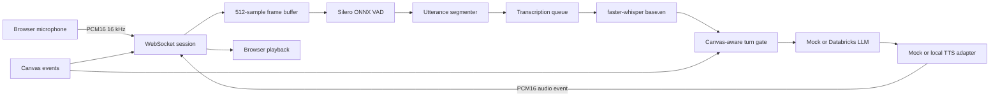

# Voice Pipeline Architecture

## Objective

Provide a local-first, observable voice loop for a system-design interview while keeping diagram awareness and interview policy outside the speech models.

The current scaffold validates this boundary:

```text
Browser audio
  -> audio normalization
  -> speech detection
  -> final transcription
  -> canvas-aware turn gate
  -> interviewer reasoning
  -> speech generation
  -> interruptible playback
```

## Component Diagram



## Chosen Baseline

### Speech To Text

- Model: `base.en`
- Runtime: `faster-whisper` with CTranslate2
- Device: CPU
- Compute type: INT8
- Language: English only
- Invocation: one final decode per VAD-delimited utterance

The model is loaded lazily and retained for the life of the process. The implementation passes NumPy audio directly to faster-whisper, avoiding a system FFmpeg dependency.

Partial Whisper decodes are intentionally absent from the decision loop. Re-decoding short rolling windows can create unstable or duplicated text. A future UI-only partial transcript layer may be added without allowing unstable text to trigger the interviewer.

### Voice Activity Detection

- Model: Silero VAD ONNX
- Frame size: 512 samples
- Sample rate: 16 kHz
- Frame duration: 32 ms
- Speech threshold: 0.5
- Negative threshold: 0.35
- Minimum speech: 96 ms
- Minimum silence: 1,200 ms
- Prefix padding: 256 ms

The ONNX wrapper preserves Silero's recurrent state and 64-sample context between frames. The downloaded artifact is pinned and checksum-verified by `scripts/download_models.py`.

The energy-based VAD exists only for dependency-free mock demonstrations and tests. It is not a production fallback.

### Language Model

The default `MockInterviewLLM` exercises grounding and question generation without making network calls. It produces one concise question based on the latest transcript or diagram delta.

The disabled-by-default Databricks adapter:

- Uses the Databricks OpenAI-compatible Responses endpoint.
- Reads credentials only on the backend.
- Sends transcript and compact diagram context, never raw audio.
- Limits the response to a short interviewer utterance.
- Does not log or return the bearer token.

No Databricks call is made unless `VOICE_LLM_BACKEND=databricks` and both required credential variables are present.

### Text To Speech

`ToneMockTTS` generates deterministic PCM tones. It proves audio serialization, playback, cancellation, and event ordering without implying production voice quality.

The next TTS adapter should implement the existing `TextToSpeech` protocol. The leading local candidate is Kokoro-82M, subject to a latency, pronunciation, and licensing evaluation. Production TTS should support:

- Clause-level incremental input.
- PCM streaming output.
- Immediate cancellation.
- Pronunciation overrides for technical terms.
- Exact reporting of text actually played when possible.

## Turn Ownership

Speech endpointing and conversational turn completion are separate decisions.

The turn gate responds only when all applicable conditions are satisfied:

```text
final transcript exists
AND candidate is not currently speaking
AND canvas has been quiet for the configured interval
AND any explicit “let me draw” hold has expired
```

If speech restarts before the response begins, pending transcript fragments are retained and combined with the continuation. If the candidate starts speaking while the assistant is generating or playing audio, the response task is cancelled and an `assistant.interrupted` event tells the browser to stop playback.

The current explicit drawing hold is a deterministic phrase matcher. A production version should use an intent classifier and release the hold when the promised canvas action completes rather than relying only on a timeout.

## Audio Capture

The browser requests:

- Echo cancellation.
- Noise suppression.
- Automatic gain control.
- One microphone channel.

An AudioWorklet resamples the browser's native capture rate to 16 kHz and sends signed 16-bit little-endian PCM frames. The backend re-chunks arbitrary message boundaries into the 512-sample frames required by Silero.

Production hardening should add:

- Audio-device change handling.
- Capture-level telemetry without retaining raw audio.
- A visible microphone permission state.
- A headset recommendation when echo cancellation is unreliable.
- Optional local noise suppression before VAD.

## Technical Vocabulary

The client supplies a glossary during session configuration. Recent selected canvas object IDs are combined with that glossary into a bounded Whisper initial prompt.

Good glossary entries are unusual, high-value terms:

```text
Kafka
Cassandra
PostgreSQL
gRPC
consistent hashing
p99 latency
QPS
idempotency
```

Avoid large lists of common words. Store the raw transcript separately from any later normalization so scoring remains auditable.

## Concurrency Model

- One WebSocket session owns its VAD recurrent state, segmenter, turn gate, and event sequence.
- A per-session queue prevents audio reception from blocking during transcription.
- The STT adapter and loaded model are shared across sessions.
- Response tasks are independently cancellable.
- WebSocket sends are serialized by an asynchronous lock.

Before multi-session deployment, benchmark CTranslate2 worker and CPU-thread settings. Do not multiply CPU threads by worker count beyond available physical cores.

## Storage and Privacy

- Raw audio remains in memory only for the active utterance.
- The scaffold does not record audio.
- Model weights and caches remain inside `.models` and `.cache` on `F:`.
- `.env`, caches, model weights, and runtime data are Git-ignored.
- Databricks credentials never reach browser JavaScript.
- The server does not automatically load `.env` files.

If transcript persistence is added, define consent, retention, encryption, deletion, and access-control policies before enabling it.

## Failure Behavior

| Failure | Current behavior | Production follow-up |
| --- | --- | --- |
| Silero model missing | WebSocket closes with `session_start_failed` | Surface guided download action |
| STT inference failure | Emits `transcription_failed` | Retry once, then offer text input |
| Empty transcript | No interviewer response | Track silence/no-speech metric |
| LLM/TTS failure | Emits `response_failed` | Provider fallback and text-only response |
| Invalid JSON control event | Emits `invalid_json` | Add schema version negotiation |
| Browser disconnect | Cancels tasks and clears VAD state | Resume session from durable event log |

## Latency Budget

Initial targets for the target development machine:

| Stage | Target |
| --- | ---: |
| VAD processing per 32 ms frame | under 2 ms |
| Speech endpoint wait | 1,200 ms baseline, tunable |
| `base.en` final decode | under 600 ms p95 for a typical utterance |
| Canvas gate after final edit | 1,500 ms |
| Live LLM first token | under 800 ms p95 |
| TTS first audio | under 250 ms p95 |
| End of candidate turn to first audio | under 2 seconds p95 |

The VAD silence and canvas quiet periods overlap where possible. They should not be blindly summed in product latency calculations.

## Next Implementation Steps

1. Add clause-streaming local TTS behind the existing protocol.
2. Add a structured diagram reducer instead of the drawing stub.
3. Attach selected object IDs and semantic diagram deltas to each transcript turn.
4. Add speculative LLM generation after a high-confidence eager endpoint, with cancellation.
5. Add replayable session-event fixtures and latency traces.
6. Add provider fallbacks and circuit breakers.
7. Test on low-end Windows hardware and expected candidate accents.
