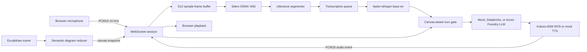

# Voice Pipeline Architecture

## Objective

Provide a local-first, observable voice loop for a system-design interview while keeping diagram awareness and interview policy outside the speech models.

The current scaffold validates this boundary:

```text
Browser audio
  -> audio normalization
  -> speech detection
  -> final transcription
  -> canvas-aware turn gate
  -> interviewer reasoning
  -> speech generation
  -> interruptible playback
```

## Component Diagram



## Chosen Baseline

### Speech To Text

- Model: `base.en`
- Runtime: `faster-whisper` with CTranslate2
- Device: CPU
- Compute type: INT8
- Language: English only
- Invocation: one final decode per VAD-delimited utterance

The model is loaded lazily and retained for the life of the process. The implementation passes NumPy audio directly to faster-whisper, avoiding a system FFmpeg dependency.

Partial Whisper decodes are intentionally absent from the decision loop. Re-decoding short rolling windows can create unstable or duplicated text. A future UI-only partial transcript layer may be added without allowing unstable text to trigger the interviewer.

### Voice Activity Detection

- Model: Silero VAD ONNX
- Frame size: 512 samples
- Sample rate: 16 kHz
- Frame duration: 32 ms
- Speech threshold: 0.5
- Negative threshold: 0.35
- Minimum speech: 192 ms
- Minimum silence: 1,200 ms
- Prefix padding: 256 ms

The ONNX wrapper preserves Silero's recurrent state and 64-sample context between frames. The downloaded artifact is pinned and checksum-verified by `scripts/download_models.py`.

The energy-based VAD exists only for dependency-free mock demonstrations and tests. It is not a production fallback.

### Language Model

The default `MockInterviewLLM` now exercises deterministic phase progression, question threading, evidence updates, and feedback without making network calls. Remote providers share a normalized gateway that supports messages, bounded output, strict JSON Schema output, final responses, SSE deltas, timeout handling, and bounded transient retries.

- Databricks uses its OpenAI-compatible Responses endpoint and bearer authentication.
- Azure AI Foundry uses model-inference Chat Completions and `api-key` authentication.
- Candidate transcript and a compact validated diagram snapshot are serialized as explicitly untrusted JSON evidence.
- A per-session engine adds the current phase, active question, assumptions, decisions, recent evidence, rubric coverage, and six recent turns.
- Provider output is a strict plan; the local reducer controls phase adjacency and state mutation.
- Diagram-only evidence cannot upgrade rubric coverage.
- Direct diagram-visibility and repeat-question repairs bypass the provider.
- Provider response bodies and authorization values are excluded from errors.
- Streams are retried only before their first emitted text delta.
- The current voice pipeline still waits for final interviewer text before batch TTS.

No remote request is made unless its `VOICE_LLM_BACKEND` value and required credential variables are explicitly configured. See `docs/INTERVIEW_ENGINE.md` and `docs/LLM_PROVIDERS.md` for the state, policy, and provider contracts.

### Text To Speech

- Model: Kokoro-82M v1.0 INT8 ONNX
- Runtime: `kokoro-onnx` with ONNX Runtime CPU execution
- Default voice: `af_heart`, configurable without changing model weights
- Output: mono signed PCM16 at 24 kHz
- Model footprint: approximately 88 MiB plus a 27 MiB voice pack
- Licenses: MIT adapter/runtime package and Apache-2.0 model

The model and voice pack are checksum-pinned by `scripts/download_models.py`. `KokoroTTS` loads them lazily, retains one engine for the process, and serializes synthesis because the phonemizer and ONNX session are shared. Text, voice, language, and speed stay local.

The current adapter generates a complete short interviewer utterance before emitting one audio event. Cancellation stops delivery immediately, while an already-running native inference finishes in its worker thread before that shared engine is reused. Future hardening should add clause streaming, pronunciation overrides for technical terms, and played-text reconciliation.

On the current CPU-only development machine, warm Kokoro inference is the dominant speech-start bottleneck and runs at roughly 2.5 times generated audio duration. See `docs/TTS_LATENCY_FINDINGS.md` for the measured cold load, response-length scaling, stage breakdown, non-solutions, and ranked optimization plan.

`ToneMockTTS` remains available under `--mock` for fast deterministic protocol tests.

## Turn Ownership

Speech endpointing and conversational turn completion are separate decisions.

The turn gate responds only when all applicable conditions are satisfied:

```text
final transcript exists
AND candidate is not currently speaking
AND canvas has been quiet for the configured interval
AND any explicit "let me draw" hold has expired
```

If speech restarts before the response begins, pending transcript fragments are retained and combined with the continuation. If the candidate starts speaking while the assistant is generating or playing audio, the response task is cancelled and an `assistant.interrupted` event tells the browser to stop playback.

After `session.configure`, the interviewer schedules a short introduction and first requirements question. Finishing waits for queued STT, drains the last transcript without the normal quiet delay, and generates structured feedback.

The current explicit drawing hold is a deterministic phrase matcher. A production version should use an intent classifier and release the hold when the promised canvas action completes rather than relying only on a timeout.

## Audio Capture

The browser requests:

- Echo cancellation.
- Noise suppression.
- Automatic gain control.
- One microphone channel.

An AudioWorklet resamples the browser's native capture rate to 16 kHz and sends signed 16-bit little-endian PCM frames. The backend re-chunks arbitrary message boundaries into the 512-sample frames required by Silero.

Production hardening should add:

- Audio-device change handling.
- Capture-level telemetry without retaining raw audio.
- A visible microphone permission state.
- A headset recommendation when echo cancellation is unreliable.
- Optional local noise suppression before VAD.

## Technical Vocabulary

The client supplies a glossary during session configuration. Diagram labels and inferred roles, with selected components first, are combined with that glossary into bounded faster-whisper `hotwords`. Opaque Excalidraw IDs are never used as vocabulary.

An earlier implementation used the natural-language initial prompt `System design interview. Expected technical terms: ...` for every utterance. A 350 ms speech fragment reproduced a prompt echo as the transcript `System design interview.` The adapter now uses the dedicated hotwords option, rejects segments over the standard compression-ratio limit, rejects low-log-probability or high-no-speech decodes, and drops incomplete connector words from sub-800 ms fragments. If no segment survives, the browser receives `candidate.transcript.rejected` and invites the candidate to retry instead of advancing the interview.

Good glossary entries are unusual, high-value terms:

```text
Kafka
Cassandra
PostgreSQL
gRPC
consistent hashing
p99 latency
QPS
idempotency
```

Avoid large lists of common words. Store the raw transcript separately from any later normalization so scoring remains auditable.

## Concurrency Model

- One WebSocket session owns its VAD recurrent state, segmenter, turn gate, and event sequence.
- The same session owns its mutable interview phase, question thread, evidence ledger, and rubric coverage.
- A per-session queue prevents audio reception from blocking during transcription.
- The STT adapter and loaded model are shared across sessions.
- The TTS adapter and loaded model are shared, with synthesis serialized by a lock.
- Response tasks are independently cancellable.
- WebSocket sends are serialized by an asynchronous lock.

Before multi-session deployment, benchmark CTranslate2 worker and CPU-thread settings. Do not multiply CPU threads by worker count beyond available physical cores.

## Storage and Privacy

- Raw audio remains in memory only for the active utterance.
- The scaffold does not record audio.
- Model weights and caches remain inside `.models` and `.cache` on `F:`.
- `.env`, caches, model weights, and runtime data are Git-ignored.
- Interview state remains in memory and is discarded when the WebSocket closes.
- Databricks and Azure Foundry credentials never reach browser JavaScript.
- The server does not automatically load `.env` files.

If transcript persistence is added, define consent, retention, encryption, deletion, and access-control policies before enabling it.

## Failure Behavior

| Failure | Current behavior | Production follow-up |
| --- | --- | --- |
| Silero model missing | WebSocket closes with `session_start_failed` | Surface guided download action |
| Kokoro files missing | Emits `response_failed` on first response | Surface guided download action before session start |
| STT inference failure | Emits `transcription_failed` | Retry once, then offer text input |
| Empty or unreliable transcript | Emits `candidate.transcript.rejected`; no interviewer response | Track rejection reason and input-level telemetry |
| Invalid plan or LLM failure | Emits `response_failed` before applying state | Provider fallback and retry |
| TTS failure | Preserves accepted state and text, then emits `response_failed` | Continue in text-only mode |
| Invalid JSON control event | Emits `invalid_json` | Add schema version negotiation |
| Invalid diagram snapshot | Emits `invalid_diagram` and retains prior state | Report client/schema mismatch |
| Browser disconnect | Cancels tasks and clears VAD state | Resume session from durable event log |

## Latency Budget

Initial targets for the target development machine:

| Stage | Target |
| --- | ---: |
| VAD processing per 32 ms frame | under 2 ms |
| Speech endpoint wait | 1,200 ms baseline, tunable |
| `base.en` final decode | under 600 ms p95 for a typical utterance |
| Canvas gate after final edit | 1,500 ms |
| Live LLM first token | under 800 ms p95 |
| TTS first audio | under 250 ms p95 |
| Warm Kokoro synthesis | under 1.0 real-time factor |
| End of candidate turn to first audio | under 2 seconds p95 |

The VAD silence and canvas quiet periods overlap where possible. They should not be blindly summed in product latency calculations. The first-audio targets require the planned clause-streaming TTS path; the current full-response adapter is a functional baseline.

## Next Implementation Steps

1. Stream Kokoro synthesis at clause boundaries behind the existing protocol.
2. Add problem-specific rubric templates, time budgets, and configurable interview levels.
3. Add an explicit system-design component palette that writes semantic roles into Excalidraw `customData`.
4. Persist opt-in replayable session events for recovery and offline evaluation.
5. Add speculative LLM generation after a high-confidence eager endpoint, with cancellation.
6. Add provider fallbacks and circuit breakers.
7. Test conversation quality on low-end Windows hardware and expected candidate accents.
